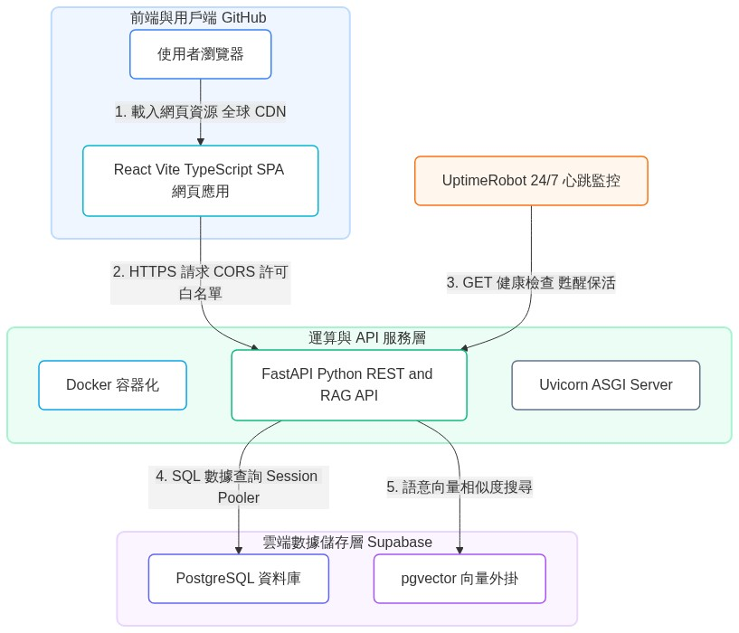

# ⚡️ 台灣電力觀測站 (Taiwan Electricity Dashboard)

這是一個結合**「台灣電力歷史統計 Dashboard」**與**「能源政策 / 用電原因 AI 智能問答」**的生產級資料應用系統。

本專案採用**前後端分離 (Decoupled)** 與**多雲混合 (Multi-Cloud)** 的免費雲端部署架構，前端 React 網頁藉由全球 CDN 分發，後端 FastAPI 容器與 Supabase 雲端資料庫（支援 PostgreSQL 與 pgvector）順利對接，實現了 **「0 成本、高可用性、極速載入」** 的雲端服務。

---

## 🌐 線上展示與系統入口 (Live Demo)

* 🖥️ **前端系統入口 (GitHub Pages)**: [點此拜訪網頁](https://cocolate00.github.io/taiwan-electricity-dashboard/)
* ⚙️ **後端健康檢查 (Render API)**: [API 運行狀態](https://taiwan-electricity-dashboard.onrender.com/api/health)
* 📑 **詳細設計文件導覽**: [docs/README.md](docs/README.md)

---

## 🎨 系統技術棧架構藍圖 (System Architecture)

專案的核心部署架構與資料流向如下圖所示：



---

## 🚀 專案核心技術亮點 (Highlights)

1. **前後端分離與 0 成本雲端部署**：
   * 前端 React + Vite 靜態資源發布於 GitHub Pages，享受 CDN 全球加速。
   * 後端 FastAPI 封裝於 Docker 生產環境容器，部署在 Render.com。
   * 資料庫採用 Supabase PostgreSQL，省去自建資料庫的維護成本。
2. **UptimeRobot 24/7 心跳防休眠機制**：
   * 免費版 Render 主機在 15 分鐘無人存取後會自動進入休眠，導致下一次請求面臨 30-50 秒的冷啟動延遲。
   * 本專案設計了輕量級健康檢查 API，並配置 UptimeRobot 每 5 分鐘發送心跳請求，**成功以 0 成本維持容器 24 小時活躍，提供即時響應**。
3. **0-Token 語意快取攔截器 (Semantic Cache)**：
   * 為了克服大語言模型（LLM）呼叫延遲高（約 3-5 秒）與 API 費用高昂的限制，後端使用 `pgvector` 外掛對提問與常見問答庫（FAQs）進行 Cosine 相似度比對。
   * **相似度 $\ge 0.90$ 時物理攔截並直接返回預存標準回答與 Recharts JSON，Token 消耗為 0，響應時間降至 0.05 秒以內**。
4. **完全杜絕 AI 幻覺 (Zero-Hallucination Fallback)**：
   * 當使用者提問相似度低於 $0.90$ 時，系統不盲目調用大模型進行猜測，而是直接進入官方資源引導機制，回傳權威來源連結（如台電官網、能源署），確保數據與政策資訊的嚴謹度。
5. **測試驅動開發 (TDD & Mocking)**：
   * 後端基於 `pytest` + `httpx` 建立完整自動化單元與整合測試。
   * 透過 Mock 掉 `EmbeddingService` 阻斷外部網路呼叫，在 **100% 離線與 0 消耗 API Key 的狀況下，驗證 RAG 快取與路由邏輯 100% 通過**。

---

## 📂 專案檔案結構 (Directory Structure)

```text
cocolate00/taiwan-electricity-dashboard/
├── backend/                   # FastAPI 後端服務
│   ├── app/
│   │   ├── api/              # API 控制器 (Charts 查詢、AI 對話、健康檢查)
│   │   ├── core/             # 核心配置與資料庫 Session 管理
│   │   ├── models/           # SQLAlchemy 資料庫 ORM 模型
│   │   ├── repositories/     # SQLAlchemy 資料存取層
│   │   └── services/         # 業務邏輯與 RAG 攔截運算服務
│   └── tests/                # pytest 單元與整合測試套件
├── frontend/                  # React 前端 SPA 網頁
│   ├── src/
│   │   ├── components/       # 共享 UI 組件 (導覽列、頁尾、空狀態)
│   │   └── pages/            # 頁面組件 (Dashboard 儀表板、對話頁、百科百科)
│   └── nginx.conf            # 生產環境 Nginx 設定
└── docs/                      # 系統架構設計與面試準備說明文件
```

---

## ⚙️ 本地開發與快速啟動 (Local Setup)

專案已完全容器化，您可以在本機電腦上一鍵啟動前後端與資料庫：

1. **複製本專案至本地**：
   ```bash
   git clone https://github.com/cocolate00/taiwan-electricity-dashboard.git
   cd taiwan-electricity-dashboard
   ```
2. **複製並設定環境變數**：
   ```bash
   cp .env.example .env
   # 在 .env 中填寫您的 GEMINI_API_KEY 與資料庫連線資訊
   ```
3. **啟動 Docker 容器組**：
   ```bash
   docker compose up --build -d
   ```
4. **初始化資料庫結構與數據 Seeding**：
   ```bash
   # 執行 Alembic 同步雲端或本地資料庫 Schema
   docker compose exec backend alembic upgrade head
   
   # 匯入電力發用電數據與 28 筆問答向量庫
   docker compose exec backend python scripts/seed_structured_data.py
   ```
5. **訪問網頁**：
   * 前端網頁: `http://localhost:3000`
   * 後端健康檢查: `http://localhost:8080/api/health`

---

## 📜 更多深入設計文件 (Documentation)

歡迎點閱專案中的 `docs/` 資料夾查看更多細節：
* 🌐 **[系統架構設計書 (docs/system_design.md)](docs/system_design.md)**：包含分離式部署拓撲圖與 0-Token 語意快取攔截流程圖。
* 📐 **[元件開發架構解析 (docs/development_architecture.md)](docs/development_architecture.md)**：詳細剖析後端三層式設計（Controller, Service, Repository）與前端組件連動。
* 🎓 **[開發者學習與面試實戰指南 (docs/developer_interview_guide.md)](docs/developer_interview_guide.md)**：面試官最關心的 6 大硬核問題與回答套路。
* 📑 **[AI 開發防錯教訓與指引 (docs/ai_lessons_learned.md)](docs/ai_lessons_learned.md)**：9 大踩坑 Bug 排除與防錯 System Prompt 模板。

---

## 🚧 限制與未來待優化展望 (Roadmap & Future Scope)

為了能將專案快速部署上線並落實 0 成本運行，本專案在 RAG (檢索增強生成) 部分進行了工程上的取捨。以下為本系統目前的限制與未來優化方向：

### 1. 目前 RAG 的工程局限與折衷
* **語意快取攔截限制**：目前系統在問答上，高度依賴向量資料庫中的 28 筆 FAQs。當相似度 $\ge 0.90$ 時，由後端物理攔截直接返回預存標準答案與圖表。
* **低相似度退路限制**：當使用者提問低於 $0.90$ 時，為避免 API 呼叫產生費用、延遲，並徹底防範 AI 的胡言亂語（幻覺），系統目前**直接轉入官方資源引導機制，沒有進一步調用大模型對非結構化政策報告（PDF）進行即時的 Chunk 切片檢索與生成**。

### 2. 未來優化路線圖 (Future Roadmap)
* **實作動態 RAG 生成（Ollama 本地化）**：
  * 未來可配置 Gemini 計費帳戶或在後端 Docker 中串接開源的本地大模型（如 `Ollama` + `Qwen 2.5`）。
  * 當相似度落在 $0.60 \sim 0.90$ 區間時，調用 `LangChain` 或 `LlamaIndex`，動態檢索 `document_chunks` 表中的政策背景文件，生成結構化的客製化回答。
* **升級為混合檢索 (Hybrid Search)**：
  * 目前僅採用 `pgvector` 的 Cosine 相似度向量比對。未來可升級為結合 PostgreSQL 內建全文檢索 (Full-Text Search) 的混合檢索（Semantic + Keyword BM25），並實作 `Cross-Encoder` 重排序 (Re-ranking) 演算法，提升對「夜尖峰」、「備轉容量」等电力專業術語的檢索精準度。
* **多模態 RAG (Multimodal RAG)**：
  * 台電與能源署的政策報告中包含大量複雜的統計圖表。未來可引入支援視覺的多模態大模型，實現「圖表問答」，讓 AI 能夠直接辨識並解讀政策簡報中的趨勢圖像，提供更深度的政策剖析。
