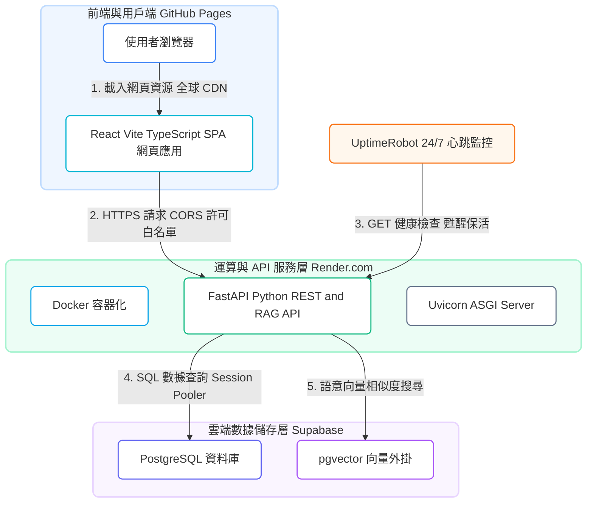

# 🗺️ 「台灣電力觀測站」技術棧系統架構圖 (Tech Stack Architecture)

本文件展示並解析了本專案的**實體技術棧架構圖**，包含前端 (React/Vite)、後端 (FastAPI/Docker) 以及資料庫 (Supabase/PostgreSQL/pgvector) 之間的具體技術組件串接、外部心跳保活機制與資料流向。

---

## 🎨 1. 技術棧實體架構視覺圖 (PPT 報告推薦)

下圖為 AI 為您精心繪製的技術棧實體架構示意圖（包含 React、FastAPI、Docker、PostgreSQL 的官方代表 Icon 與分層流向），非常適合直接截圖放入您的面試簡報 (Slides) 或 GitHub README 中：

---

## ⚙️ 2. 精準色彩語意系統架構圖 (Mermaid Code & 實體圖片)

為了讓您在 Markdown 或 GitHub 上能 100% 精確地呈現文字與指向，我使用自訂色彩與樣式美化了 Mermaid 流程圖。此圖將前端（藍色系）、後端（綠色系）與資料庫（紫色系）進行了視覺分群。

### 🎨 Mermaid 實體渲染圖片 (可直接下載放入簡報)：

### 💻 Mermaid 原始碼：

---

## 📝 3. 技術棧各層級角色詳解

1. **前端 (React/Vite/TS)**：
   * 運行在使用者瀏覽器中，發送異步網路請求 (Axios/Fetch) 來讀取電力統計與和 AI 問答。
   * 以單頁面應用 (SPA) 渲染，切換分頁時無需向伺服器重新請求 HTML 網頁，載入速度極快。
2. **後端 (Docker/FastAPI/Uvicorn)**：
   * 被封裝在獨立的 Docker 生產環境容器中，確保無論在何處啟動都能有一致的 Python 環境。
   * 利用 FastAPI 非同步框架高吞吐的優點，高效率處理 Dashboard 的 JSON 數據庫查詢與 RAG 的語意檢索比對。
3. **資料庫 (PostgreSQL/pgvector)**：
   * 託管於 Supabase 雲端，同時存放「結構化電力歷史數據」與「問答語意向量 (Vector)」。
   * 當提問傳入時，利用 `pgvector` 外掛對問題向量與 FAQ 表進行餘弦相似度 (Cosine Similarity) 比對，快速過濾標準答案。
