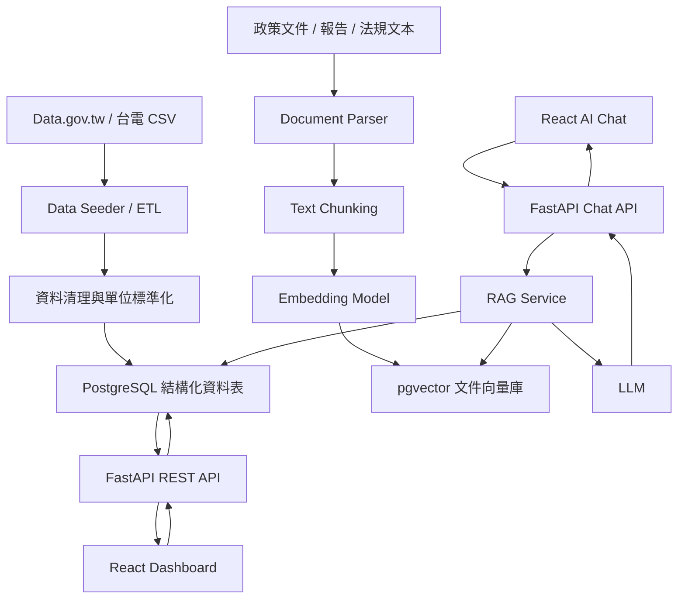

# 台灣電力資料 Dashboard + RAG AI 問答系統專案藍圖

## 1. 專案定位

本專案目標是建立一套結合「台灣電力統計 Dashboard」與「能源政策 / 用電原因 AI 問答」的資料應用系統。

系統會先匯入政府開放資料、台電歷史 CSV、政策文件與分析文本，將結構化統計資料存入 PostgreSQL，並將知識型文本切分、向量化後存入 pgvector。前端使用 React 呈現圖表與 AI 對話介面，後端使用 FastAPI 提供資料 API 與 RAG 問答服務。

核心價值：

- 讓使用者快速查看台灣發電、用電、能源占比與產業用電變化。
- 讓使用者用自然語言詢問能源政策、用電成長原因、產業趨勢。
- 結合結構化資料與知識文件，降低 AI 幻覺並保留資料來源。
- 使用 Docker Compose 封裝，方便本地開發與未來部署。

## 2. 系統總覽



## 3. 技術棧

| Layer | 技術 | 用途 |
|---|---|---|
| Frontend | React + Vite | 建立 Dashboard 與 AI Chat UI |
| Styling | Tailwind CSS | 快速建立一致的介面樣式 |
| Charts | Recharts | 折線圖、長條圖、圓餅圖、堆疊圖 |
| Backend | Python + FastAPI | REST API、Chat API、資料服務 |
| ORM | SQLAlchemy | 管理 PostgreSQL 資料模型 |
| Migration | Alembic | 管理資料庫 schema 版本 |
| Data Processing | pandas + pydantic | CSV 清理、欄位轉換、資料驗證 |
| RAG | LangChain 或 LlamaIndex | 文件檢索、Prompt 組裝、LLM 串接 |
| Database | PostgreSQL + pgvector | 結構化統計資料 + 向量資料 |
| Infra | Docker + Docker Compose | 本地一鍵啟動 |
| Testing | pytest | 後端 API、Seeder、RAG service 測試 |

建議 MVP 優先使用：

```text
React + Vite
FastAPI
PostgreSQL + pgvector
SQLAlchemy + Alembic
pandas
OpenAI-compatible Embedding / LLM API
Docker Compose
```

## 4. 主要資料流

### 4.1 靜態統計資料匯入

```text
CSV 原始資料
  ↓
讀取與編碼處理
  ↓
欄位名稱標準化
  ↓
年份、月份、能源別、產業別、單位轉換
  ↓
資料驗證
  ↓
寫入 PostgreSQL 結構化資料表
```

常見資料清理注意事項：

- 民國年與西元年轉換。
- 單位統一，例如度、千度、百萬度、kWh、MWh。
- 移除合計列、註解列、空白列。
- 處理 Big5 / UTF-8 編碼差異。
- 能源分類名稱統一，例如「太陽光電」、「太陽能」、「光電」需正規化。

### 4.2 知識文件匯入

```text
政策文件 / 報告 / 分析文本
  ↓
抽取純文字
  ↓
切分 chunks
  ↓
建立 metadata
  ↓
Embedding 模型轉向量
  ↓
存入 document_chunks + pgvector
```

建議 chunk 策略：

- 每段約 500 到 1000 中文字。
- chunk 之間保留 100 到 150 字 overlap。
- metadata 保留文件標題、來源 URL、發布日期、章節名稱、資料類型。

### 4.3 Dashboard 查詢流程

```text
React 圖表頁
  ↓
呼叫 FastAPI REST endpoint
  ↓
FastAPI 查詢 PostgreSQL
  ↓
回傳 JSON
  ↓
Recharts 渲染圖表
```

### 4.4 AI 問答流程

```text
使用者輸入問題
  ↓
FastAPI Chat API
  ↓
問題分類：數據查詢 / 政策問答 / 混合問題
  ↓
pgvector 語意搜尋
  ↓
必要時查詢 PostgreSQL 統計資料
  ↓
組裝 context + prompt
  ↓
LLM 產生答案
  ↓
回傳答案、引用來源、相關資料
```

AI 回答應包含：

- 簡明回答。
- 主要依據。
- 相關數據或政策摘要。
- 來源引用。
- 若資料不足，明確說明無法判斷。

## 5. 建議專案目錄

```text
energy-dashboard-rag/
  docker-compose.yml
  .env.example
  README.md

  frontend/
    Dockerfile
    package.json
    vite.config.ts
    src/
      main.tsx
      App.tsx
      api/
        client.ts
        charts.ts
        chat.ts
      components/
        charts/
        chat/
        layout/
      pages/
        DashboardPage.tsx
        ChatPage.tsx
      types/

  backend/
    Dockerfile
    pyproject.toml
    alembic.ini
    app/
      main.py
      api/
        health.py
        charts.py
        chat.py
      core/
        config.py
        database.py
      models/
        power.py
        documents.py
      schemas/
        chart.py
        chat.py
      repositories/
        power_repository.py
        document_repository.py
      services/
        chart_service.py
        rag_service.py
        embedding_service.py
        llm_service.py
      prompts/
        rag_answer.zh-tw.txt
    scripts/
      seed_structured_data.py
      seed_documents.py
      reindex_embeddings.py
    tests/
      test_health.py
      test_chart_api.py
      test_seeders.py

  data/
    raw/
      csv/
      documents/
    processed/
    samples/

  db/
    init/
      enable_pgvector.sql
```

## 6. 資料庫設計

### 6.1 結構化統計資料表

#### power_generation

用於各能源別發電量。

```text
id
year
month
energy_type
generation_mwh
percentage
source_name
source_url
created_at
updated_at
```

#### power_consumption_by_industry

用於產業別用電統計。

```text
id
year
industry
consumption_kwh
percentage
source_name
source_url
created_at
updated_at
```

#### power_demand_summary

用於年度或月度總用電、尖峰負載等摘要指標。

```text
id
year
month
metric_name
metric_value
unit
source_name
source_url
created_at
updated_at
```

### 6.2 文件與向量資料表

#### documents

```text
id
title
source_type
source_url
published_at
language
created_at
updated_at
```

#### document_chunks

```text
id
document_id
chunk_index
chunk_text
embedding vector
metadata jsonb
created_at
updated_at
```

建議索引：

```sql
CREATE INDEX ON power_generation (year, month);
CREATE INDEX ON power_generation (energy_type);
CREATE INDEX ON power_consumption_by_industry (year, industry);
CREATE INDEX ON documents (source_type, published_at);
CREATE INDEX ON document_chunks USING ivfflat (embedding vector_cosine_ops);
```

## 7. API 設計

### 7.1 Health

```http
GET /api/health
```

Response:

```json
{
  "status": "ok"
}
```

### 7.2 發電量趨勢

```http
GET /api/charts/generation?start_year=2014&end_year=2024&energy_type=solar
```

Response:

```json
{
  "data": [
    {
      "year": 2024,
      "month": 1,
      "energy_type": "solar",
      "generation_mwh": 123456.7,
      "percentage": 8.5
    }
  ]
}
```

### 7.3 產業用電

```http
GET /api/charts/industry-consumption?year=2024
```

Response:

```json
{
  "data": [
    {
      "industry": "半導體業",
      "consumption_kwh": 123456789,
      "percentage": 18.2
    }
  ]
}
```

### 7.4 AI Chat

```http
POST /api/chat
```

Request:

```json
{
  "message": "為什麼近年台灣用電量持續增加？",
  "conversation_id": "optional-id"
}
```

Response:

```json
{
  "answer": "近年台灣用電量增加主要與半導體與資料中心等高耗能產業擴張、電氣化趨勢、夏季尖峰需求上升有關...",
  "sources": [
    {
      "title": "能源政策相關報告",
      "source_url": "https://example.com/report",
      "snippet": "..."
    }
  ],
  "related_metrics": [
    {
      "name": "工業部門用電量",
      "year": 2024,
      "value": 123456789,
      "unit": "kWh"
    }
  ]
}
```

## 8. RAG 設計

### 8.1 問題分類

後端接收到問題後，先做簡單分類：

```text
數據查詢：例如「2020 到 2024 太陽能發電量變化？」
政策問答：例如「再生能源政策目標是什麼？」
原因分析：例如「為什麼用電大戶用電增加？」
混合問題：例如「半導體用電增加和能源轉型有什麼關係？」
```

MVP 可先用規則判斷，之後再用 LLM classifier。

### 8.2 Retrieval

建議流程：

```text
使用者問題
  ↓
產生 query embedding
  ↓
pgvector top_k 搜尋
  ↓
依 metadata 過濾 source_type / published_at
  ↓
回傳最相關 chunks
```

預設參數：

```text
top_k = 5
similarity_metric = cosine distance
min_score_threshold = 視 embedding 模型調整
```

### 8.3 Prompt 原則

系統提示應要求模型：

- 使用繁體中文回答。
- 優先根據提供的 context。
- 不要編造來源或數字。
- 資料不足時明確說不知道。
- 回答能源政策與用電原因時，附上可追溯來源。

## 9. Docker Compose 設計

建議服務：

```text
frontend
backend
db
migration
seeder
```

開發流程：

```bash
docker compose up db
docker compose run backend alembic upgrade head
docker compose run backend python scripts/seed_structured_data.py
docker compose run backend python scripts/seed_documents.py
docker compose up frontend backend
```

環境變數：

```text
DATABASE_URL=postgresql+psycopg://postgres:postgres@db:5432/energy
POSTGRES_USER=postgres
POSTGRES_PASSWORD=postgres
POSTGRES_DB=energy
EMBEDDING_PROVIDER=openai
EMBEDDING_MODEL=text-embedding-3-small
LLM_PROVIDER=openai
LLM_MODEL=gpt-4o-mini
OPENAI_API_KEY=
```

如果要走完全本地化，可替換成：

```text
EMBEDDING_PROVIDER=sentence_transformers
EMBEDDING_MODEL=BAAI/bge-m3
LLM_PROVIDER=ollama
LLM_MODEL=qwen2.5:7b
```

## 10. Frontend 頁面規劃

### 10.1 DashboardPage

主要圖表：

- 年度總發電量趨勢。
- 各能源別發電占比。
- 再生能源發電量變化。
- 產業別用電量排名。
- 尖峰負載或用電成長摘要。

主要互動：

- 年份篩選。
- 能源別篩選。
- 產業別篩選。
- 圖表 tooltip。
- 資料來源顯示。

### 10.2 ChatPage

主要功能：

- 使用者輸入自然語言問題。
- AI 回答能源政策、用電趨勢與原因分析。
- 顯示引用來源。
- 顯示關聯數據。
- 保留簡單 conversation state。

## 11. MVP 里程碑

### Phase 1: 專案骨架

- 建立 Docker Compose。
- 建立 React + Vite 專案。
- 建立 FastAPI 專案。
- 建立 PostgreSQL + pgvector。
- 建立 `/api/health`。

完成標準：

- `docker compose up` 可啟動前後端與資料庫。
- 前端可呼叫後端 health API。

### Phase 2: 結構化資料 Dashboard

- 建立發電量與產業用電資料表。
- 建立 Alembic migration。
- 撰寫 CSV Seeder。
- 建立 chart API。
- 前端完成基本圖表。

完成標準：

- 可匯入至少一份台電或政府 CSV。
- Dashboard 可呈現至少 2 到 3 種圖表。

### Phase 3: 文件向量化與 RAG

- 建立 documents / document_chunks 表。
- 實作文件 parser。
- 實作 chunking。
- 實作 embedding 寫入 pgvector。
- 實作語意搜尋。

完成標準：

- 可匯入政策文件或分析文本。
- 可用問題查到相關 chunks。

### Phase 4: AI Chat

- 建立 `/api/chat`。
- 串接 RAG service。
- 串接 LLM。
- 回答附來源。
- 前端完成 Chat UI。

完成標準：

- 使用者可詢問能源政策或用電原因。
- 回答包含來源引用。

### Phase 5: 品質與展示

- 加入 loading / error states。
- 加入 API 測試。
- 加入 Seeder 測試。
- 補 README。
- 整理 demo data。

完成標準：

- 新環境可依 README 啟動。
- Demo 流程穩定可展示。

## 12. 風險與對策

| 風險 | 影響 | 對策 |
|---|---|---|
| CSV 格式不一致 | Seeder 容易壞 | 為每個資料來源建立 adapter |
| 單位混亂 | 圖表數字錯誤 | 建立 unit normalization |
| 中文 embedding 效果不穩 | RAG 找不到正確資料 | 測試不同 embedding 模型 |
| LLM 編造資料 | 回答不可信 | 強制引用來源，資料不足則拒答 |
| Docker image 過大 | 啟動慢 | MVP 先用雲端 Embedding，之後再本地化 |
| 資料更新頻率不明 | 資料過期 | 設計手動 re-seed 與 reindex 指令 |

## 13. 建議開發順序

優先順序：

1. 建立後端、前端、資料庫 Docker 骨架。
2. 建立 PostgreSQL schema 與 Alembic migration。
3. 完成一份 CSV 的 Seeder。
4. 完成 Dashboard API 與第一批圖表。
5. 加入 documents / document_chunks / pgvector。
6. 完成 RAG semantic search。
7. 完成 Chat API。
8. 完成前端 Chat UI。
9. 補測試與 README。

建議先做小而完整的 MVP，不要一開始就處理所有資料集。第一版只要能穩定展示：

- 一份發電量資料。
- 一份產業用電資料。
- 兩到三份政策或分析文件。
- Dashboard + AI Chat 的完整流程。

## 14. 第一版 Demo 問題範例

Dashboard 問題：

- 近十年台灣各能源別發電量如何變化？
- 再生能源占比是否逐年增加？
- 哪些產業是主要用電大戶？

AI Chat 問題：

- 為什麼台灣近年用電量持續增加？
- 半導體產業用電增加對電力系統有什麼影響？
- 再生能源增加後，為什麼仍需要穩定供電來源？
- 政府能源政策對用電大戶有哪些要求？

## 15. 下一步可執行任務

下一步可以直接開始建立專案骨架：

```text
建立 docker-compose.yml
建立 backend FastAPI app
建立 frontend React app
建立 PostgreSQL + pgvector
建立第一版資料表 migration
建立第一個 CSV seeder
```

完成這一步後，專案就會從規劃進入可以實際跑起來的階段。
